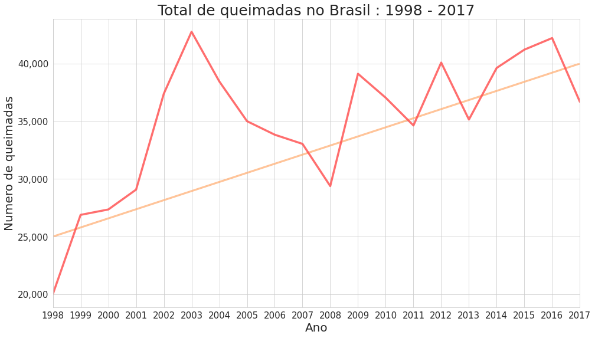
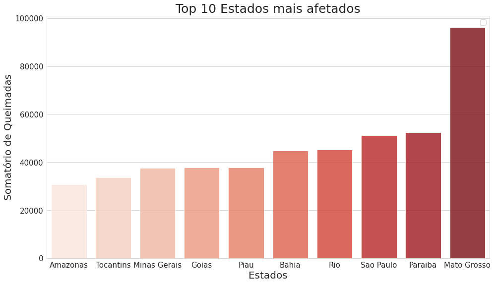
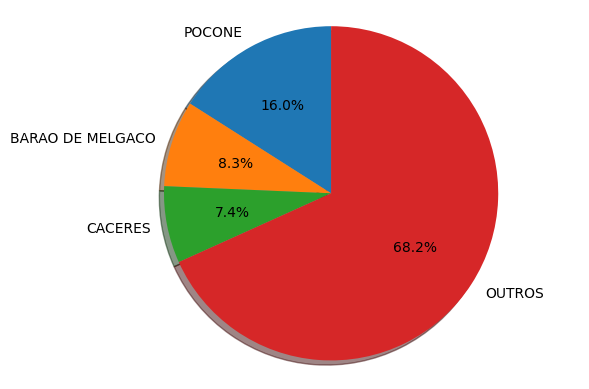
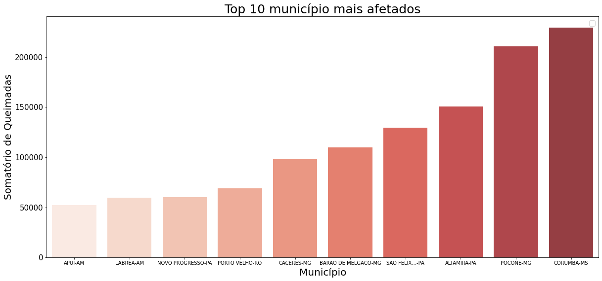
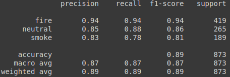
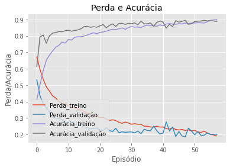
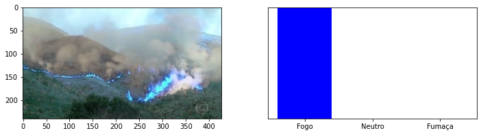
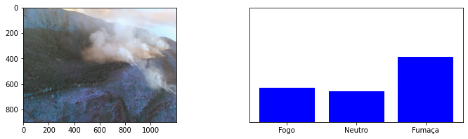
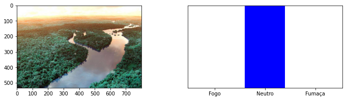
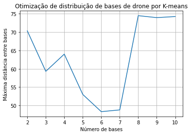

# Monitoramento-de-queimadas
Projeto para monitorar e identificar queimadas na região de Poconé - Mato Grosso, através de drones utilizando inteligência artificial.

Autores:

* Ana Thaynara Geller Kuchinski
* Calandra Renata Tilpe
* Gian Carlos Medeiros Hackbarth
* Thiago da Silva Teixeira

## Vídeo

## O problema das queimadas no Brasil
No ano de 2020 as queimadas ganharam foco nos assuntos mais importantes do ano perante o público e a mídia, o que é de se esperar, só em 2020 os pesquisadores estimam que uma área de 23 mil km² foi perdida para as queimadas. Para o tamanho do Brasil, o número não é muito expressivo, porém essa área corresponde a ¼ de Portugal, ou para melhor senso de comparação, quase 10 vezes o tamanho de Luxemburgo.

Outros países como os Estados Unidos e a Austrália também sofreram sérios danos durante o ano de 2020 referentes às queimadas, sendo que na Austrália, estima-se que as queimadas mataram ou removeram de seu habitat natural cerca de 3 bilhões de animais,sendo considerado a maior catástrofe da fauna da história moderna.

De acordo com nossos estudos usando um [bando de dados](http://dados.gov.br/dataset/sistema-nacional-de-informacoes-florestais-snif) do governo brasileiro sobre queimadas, é notável o aumento do numero de queimadas no Brasil, considerando o tempo de 1998 até 2017, como demonstra a figura 1.
 

 
Somando todos as ocorrências de queimadas neste período e classificando por estados, conforme a Figura 2, o Mato Grosso se destaca, sendo o estado com maior ocorrência de queimadas.
 

 
A cidade escolhida para a implementação do projeto foi Poconé no sul do Mato Grosso, a cidade com um dos maiores números de incidentes com queimadas, concentrando 16% das queimadas no Mato Grosso, sengundo nossas analise do [bando de dados](http://queimadas.dgi.inpe.br/queimadas/portal) de queimada do Instituto Nacional de Pesquisas Espaciais (INPE), no período de 2019-2020.
 

 
Poconé é o segundo municipio com mais ocorrências de queimadas no Brasil, com 210.805 ocorrências, perdendo somente para Corumba Mato Grosso do Sul com 229.153 ocorrências. Foi escolhido um municipio do Mato Grosso, pois além de ser o estado com maior concentração de queimadas, dos Top 10 municipio com maior numero de queimadas do Brasil, 3 são de Mato Grosso.
 

 

## O projeto
 

 

No Brasil, as áreas de queimada exigem grande esforço para serem identificadas, ou por se localizarem em mata fechada, ou por estarem em ambiente acidentado. A utilização de drones começou a ser implementada para resolver esse problema, permitindo que bombeiros e voluntários soubessem exatamente onde a queimada se localiza antes de se locomover, porém, essa opção depende de um diagnóstico humano e toda a operação depende de um piloto para o drone, além de depender de alguma denúncia ou resquício que há fogo no lugar.

Nossa solução consiste em um drone de patrulha equipado com uma câmera térmica, instalada para identificar temperaturas elevadas juntamente com um algoritmo de classificação, responsável por dar autonomia ao equipamento e retirando a necessidade de um operador durante a patrulha. O drone conta com uma inteligência artificial desenvolvida pela equipe para identificar imagens que contém fogo ou fumaça, permitindo uma análise automática, sem necessidade de um operador/piloto.

Após a identificação de alguma queimada, o drone dispara uma mensagem para centrais de órgãos que sejam responsáveis pelo combate a queimadas, mandando a localização exata do foco de incêndio. Caso a queimada esteja ocorrendo perto de rodovias, a policia rodoviaria federal irá ser acionada para o monitoramento do trânsito, para a prevenção de acidentes devido a baixa visibilidade. Caso a queimada ocorra perto da cidade, os órgãos competentes serão acionados para monitorar a possibilidade do fogo se alastrar para a cidade.

Para a realização do projeto é necessario um drone e uma câmera especial, que pode ser utilizada para aumentar a precisão da classificação em casos de queimada. As principais empresas do ramo foram contatas para o orçamento dos equipamentos necessários. Uma vez que nossa equipe esteja em posse dessa informações, será feita uma análise de viabilidade do projeto, junto com calculos mais precisos de área mapeada e autonomia do drone.

O projeto não exclui o trabalho dos bombeiros e de órgãos responsáveis pelo combate às queimadas, porém diminui consideravelmente o custo operacional dessas unidades e os riscos apresentados aos profissionais.

#### Análise de imagens usando inteligência artificial
Para que o drone consiga detectar o fogo, foi treinado uma inteligência artificial, utilizando uma rede neural convolucional.
Foi utilizado os seguintes bancos de imagens para seu treino:
https://www.kaggle.com/phylake1337/fire-dataset  
https://github.com/DeepQuestAI/Fire-Smoke-Dataset

Todo o código para o treino da rede neural pode ser encontrado no [aqui](https://colab.research.google.com/drive/1n0pGCaWW2e2nu1wJ91GudKyRzEsKWllc?usp=sharing), incluindo o [modelo treinado](https://drive.google.com/file/d/1YRx4ujvsc0Gp7HGaVilT8e9KjoCqb43k/view?usp=sharing).

As métricas demonstraram uma alta precisão para classificação de fogo, 94%, parte critica pois gera um sinal de alerta para ser confirmado visualmente pela equipe de monitoramento.

 

 

 

 

Exemplo com três imagens nunca vista pela inteligência artificial.

 

 

 

 

 

 

#### Localização ótima de bases de drones por K-means
Através do bando de dados do INPE, foi realizado uma análise dos pontos de ocorrência de queimadas. A ideia é colocar as bases dos drones perto dos pontos de maior ocorrência, de forma que a distância entre essas bases seja alcançável para os drones, e concentra-se nos pontos de maior ocorrência.

Para isto foi usado o algoritmo K-means, variando o número de cluster (que corresponde ao numero de bases) e medindo a maior distância no conjunto de bases, sendo que é considerado a distância da base atual para base mais próxima, garantindo a transferência de drone e cobrimento da área critica.

 

 

De acordo com o gráfico acima, considerando 6 bases distribuídas em Poconé, temos o ponto mínimo de distancia entre as bases, concentrando as bases na área de maior ocorrência do município, garantindo uma distância entre elas de 48.31 km.

O código pode ser consultado [aqui](https://colab.research.google.com/drive/1bzhpFcxLVKIAhykpRfPwwsKygZ5lBcpz?usp=sharing), junto com um [mapa interativo](https://thiagoteixeira.dev/bases_6_pocone.html) com a localização das bases.

Uma alternativa a utilização dessas base, seria realizar o mapeamento de todo o município. Neste caso, a partir de cálculos seguindo as [especificações do Drone](https://www.quaternium.com/uav/hybrix-drone/) foi estimada uma rota visando uma melhor leitura da área da cidade utilizando 18 Drones, a cidade tem um formato levemente parecido a um retângulo, foi assim definido algumas rotas, com uma rota pré definida para cada um, tendo ao todo 18 pontos de reabastecimento, esses pontos estão localizados em pontos comuns de encontro de rotas, assim abastecendo mais de um drone apenas.

Ao todo, uma área de 15.450Km² será coberta, desconsiderando já a área da cidade de Pocotó. A configuração do Drone permite que percorra até 200 Km, tendo que sua velocidade mantida a 50 Km/h tendo que sua autonomia é de 4 horas de vôo, podendo voar por mais tempo, mas por questão de segurança o tempo máximo está definido em 4 horas, assim cada Drone tendo uma autonomia de leitura de 200 Km de vôo.
