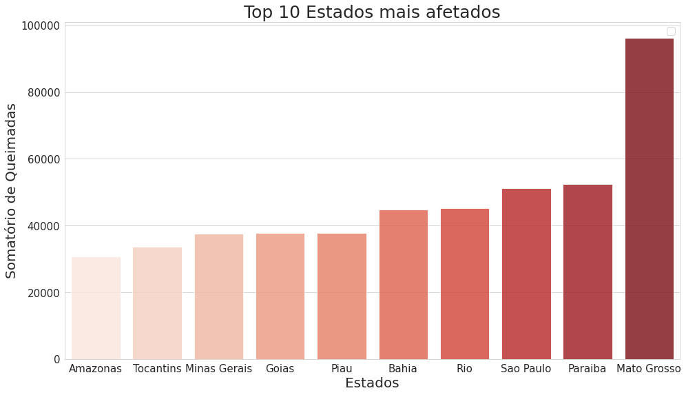

# Monitoramento-de-queimadas
Projeto para monitorar e identificar queimadas na região de Pocone - Mato Grosso, através de drones utilizando inteligência artificial.

#### O problema das queimadas no Brasil
No ano de 2020 as queimadas ganharam foco nos assuntos mais importantes do ano perante o público e a mídia, o que é de se esperar, só em 2020 os pesquisadores estimam que uma área de 23 mil km² foi perdida para as queimadas. Para o tamanho do Brasil, o número não é muito expressivo, porém essa área corresponde a ¼ de Portugal, ou para melhor senso de comparação, quase 10 vezes o tamanho de Luxemburgo.

Outros países como os Estados Unidos e a Austrália também sofreram sérios danos durante o ano de 2020 referentes às queimadas, sendo que na Austrália, estima-se que as queimadas mataram ou removeram de seu habitat natural cerca de 3 bilhões de animais,sendo considerado a maior catástrofe da fauna da história moderna.

De acordo nossos estudos usando um [bando de dados](http://dados.gov.br/dataset/sistema-nacional-de-informacoes-florestais-snif) do governo brasileiro sobre queimadas, é notavel o aumento do numero de queimadas no Brasil, considerando o tempo de 1998 até 2017, como demonstra a figura 1.
 

 
Somando todos as ocorrências de queimadas neste período e classificando por estados, conforme a Figura 2, o Mato Grosso se destaca, sendo o estado com maior ocorrência de queimadas.
 

 
